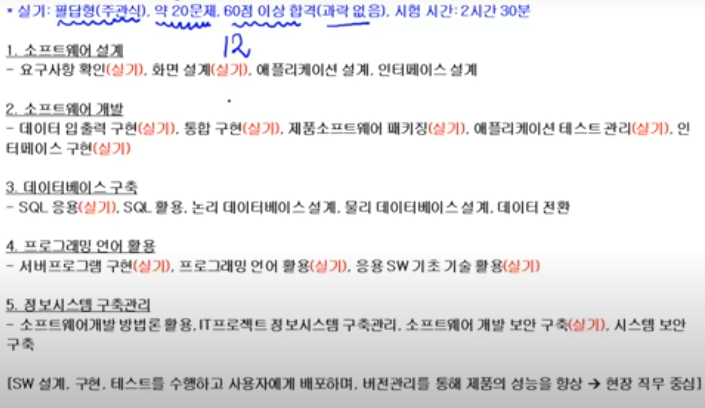
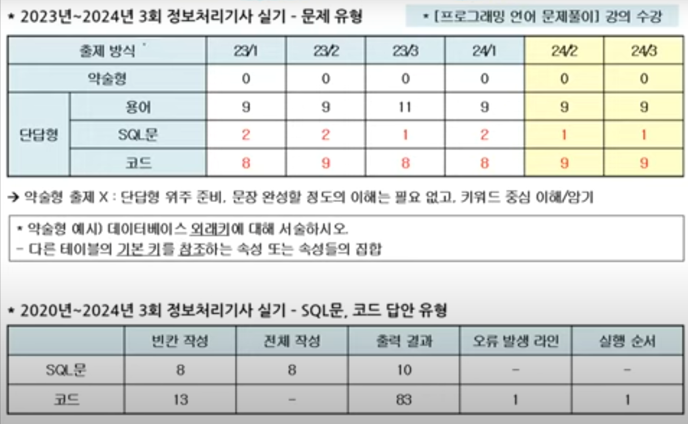
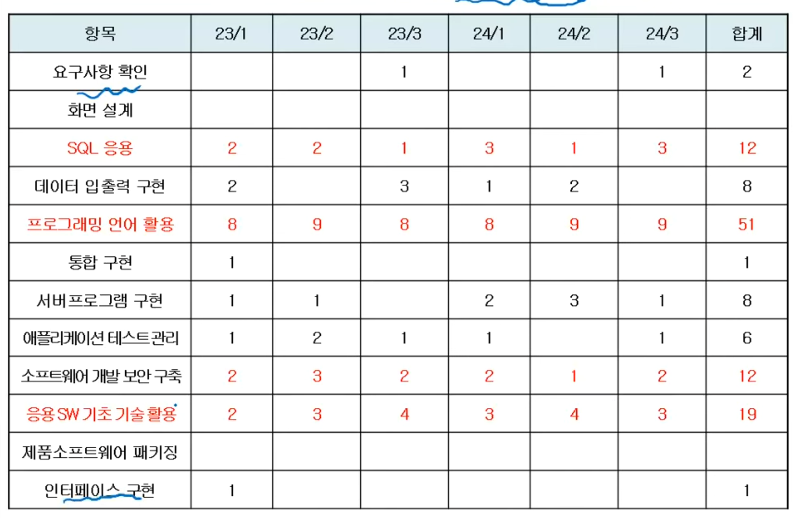
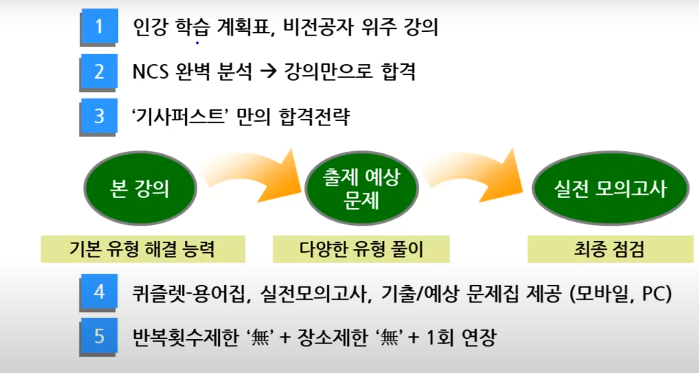

# 정보처리기사
> Information Processing Engineer  
> 컴퓨터를 효과적으로 활용하기 위해서 하드웨어뿐만 아니라 정교한 소프트웨어가 필요하다. 이에 따라 우수한 프로그램을 개발하여 업무의 효율성을 높이고, 궁극적으로 국가발전에 이바지하기 위해서 컴퓨터에 관한 전문적인 지식과 기술을 갖춘 사람을 양성할 목적으로 제정됨.

### INDEX
---
- [국가자격시험 Q-Net  ][link-q-net]
- [정보처리기사 취득방법][link-intro]

#### 문서파일
- [정보처리기사 출제기준](./docu/정보처리기사%20출제기준(2020.1.1.~2022.12.31).hwp)
- [정보처리기사 필기노트](./docu/정보처리기사_01_필기(요약).pdf)
- [정보처리기사 실기노트](./docu/정보처리기사_02_실기(요약).pdf)

[link-q-net  ]: https://www.q-net.or.kr/
[link-intro  ]: ./introduction.md

---

#### 필기시험대비

- SW설계 : 요구사항 확인, 화면 설계
- SW개발 : 데이터 입출력 구현, 통합 구현, 제품 소프트웨어 패키징, 애플리케이션 테스트 관리, 인터페이스 구현
- DB구축 : SQL응용
- PG언어 활용 : 서버프로그램 구현, 프로그래밍 언어 활용, 응용 SW 기초 기술 활요
- IS구축 관리 : 소프트웨어 개발 보안 구축
 

- 약술형 : 더이상 안나옴
- 단답형
  - 용어
  - SQL문
  - 코드 
 

- 요구사항 확인
- SQL 응용
- 데이터 입출력 구현
- 프로그래밍 언어 활용
- 서버프로그램 구현
- 애플리케이션 테스트 관리
- 소프트웨어 개발 보안 구축 
- 응용 SW 기초 기술 활용
 

 

