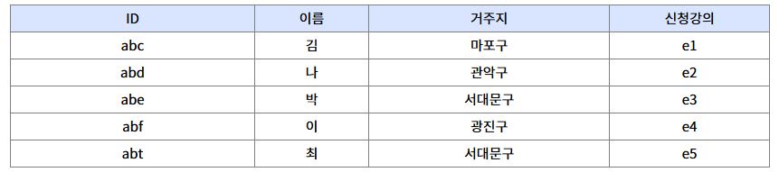

# 정보처리기사 실기 노트 정리

## 코드문제

### [정보처리기사 C언어, Java, Python, SQL 기출문제 모음](https://complainrevolutionist.tistory.com/38)

- [C](https://complainrevolutionist.tistory.com/category/C)
- [Java](https://complainrevolutionist.tistory.com/category/Java)
- [SQL](https://complainrevolutionist.tistory.com/category/%EC%98%A4%EB%9D%BC%ED%81%B4%20SQL)
  - [SQL 기출문제](#sql-기출문제)

---
### SQL 기출문제
 

- `SQL문 작성` [20년 2회 - 6번]
  - 3, 4학년의 학번, 이름을 조회한다
  - IN 예약어를 사용해야 한다
  - 속성명 아래의 괄호는 속성의 자료형을 의미한다

`정답` 
SELECT 학번, 이름 FROM 학생
WHERE 학년 in (3, 4)
 

- `SQL문 작성` ♥️♥️ 
  - <student> 테이블을 참고하여 'name' 속성으로 'idx_name'이라는 인덱스를 생성하는 SQL문을 작성

`정답`
CREATE INDEX idx_name ON student(name);
 

- `SQL문 작성`
  -  <학생> 테이블에서 '이름'이 "민수"인 튜플을 삭제하고자 한다. 다음 <처리 조건>을 참고하여 SQL문을 작성하시오.

`정답`
DELETE FROM 학생 WHERE 이름='민수';
 

- `SQL문 작성` ♥️ 
  - 다음 <성적> 테이블에서 과목별 점수의 평균이 90점 이상인 '과목이름', '최소점수', '최대점수'를 검색하고자 한다. <처리 조건>을 참고하여 적합한 SQL문을 작성하시오.
  - 처리조건: 
    - WHERE문을 사용하지않는다
    - GROUP BY와 HAVING을 이용한다
    - 집계함수를 사용하여 명령문을 구성한다
    - 최소점수, 최대점수는 별칭을 위한 A 문을 이용한다
    - 명령문 마지막의 세미콜론은 생략이  능하다
    - 인용 부호가 필요한 경우 작은 따옴표를 사용한다

`정답`
SELECT 과목이름, MIN(점수) as 최소점수, MAX(점수) as 최대점수
FROM 성적
GROUP BY 과목이름
HAVING AVG(점수) >= 90;  
 

- `SQL문 작성` ♥️♥️
  - 다음  <속성 정의서>를 참고하여 <학생> 테이블에 대해 20자의 가변 길이를 가진 '주소' 속성을 추가하는 <SQL문>을 완성하시오.

`정답`
ALTER TABLE 학생 ADD 주소 VARCHAR(20);
 
(1) ALTER   (2) ADD

- `SQL문 작성` 
  - 학생 테이블에서 학과별 튜플의 개수를 검색하시오
  

`정답`
SELECT 학과, COUNT(*) AS 학과별튜플수
FROM 학생
GROUP BY 학과

- `SQL문 결과` 
  - <EMP_TBL> 테이블을 참고하여 <SQL문>의 실행 결과

`정답`
1

- `SQL문 결과` 
  - 다음 테이블에서 카디널리티와 디그리를 구하시오.

`정답`
카디널리티: 5, 디그리 : 4  

1. 카디널리티 (Cardinality) : 관계형 데이터베이스에서 테이블에 있는 튜플(행)의 수를 의미
2. 디그리 (Degree) : 테이블의 속성(컬럼)의 수를 의미

- `SQL문 작성` 
  - <학부생>테이블에서 입학생수가 300이상인 튜플의 학과번호를 999로 갱신하는 SQL문이다 괄호(1, 2)에 알맞은 답을 쓰시오.

`정답` (1) UPDATE   (2) SET   
UPDATE 학부생 SET 학과번호 = 999 WHERE 입학생수 >= 300;

- `SQL문 작성` 
  - 다음 <사원> 테이블과 <동아리> 테이블을 조인한 <결과>를 확인하여 <SQL문>의 괄호(1, 2)에 들어갈 알맞은 답을 쓰시오. 

`정답` (1) ON   (2) 코드   
SELECT a.코드, 이름,동아리명 FROM 사원 a LEFT 동아리 b ON a.코드=b.코드 ;

- `SQL문 작성` 
  - <회원> 테이블에서 '이름'이 "이"로 시작하는 회원들을 가입일 순으로 내림차순 정렬하는 <SQL문>이다 괄호(1, 2)에 들어갈 알맞은 답을 쓰시오

`정답` (1) 이%   (2) DESC   
SELECT * FROM 회원 
WHERE 이름 LIKE '이%' 
ORDER BY 가입일 DESC;

- `SQL문 결과` ♥️
  -  <A> 테이블과 < B>테이블을 참고하여 <SQL문>의 실행결과를 쓰시오

`정답` 4

- `SQL문 작성` 
  -  <성적> 테이블에서 이름(name)과 점수(score)를 조회하되, 점수를 기준으로 내림차순 정렬하여 조회하는 <SQL문>이다. 괄호(1~3)에 알맞은 답을 적어 <SQL문>을 완성하시오.

`정답` (1) ORDER   (2) score   (3) DESC   
SELECT name, score FROM 성적
ORDER BY score DESC;

- `SQL문 작성` 
  -  상품 테이블에서 H제조사 전체 제품의 단가보다 더 큰 단가를 가진 제품을 모두 출력하는 SQL문을 완성하시오.

`정답` ALL  
SELECT 제조사, 제품명, 단가 FROM 제품 
WHERE 단가 > ALL (SELECT 단가 FROM 제품 WHERE 제조사='H')

 
Tip. SQL에서 ALL은 **하위 쿼리(Subquery)**와 함께 사용되어 조건을 모든 결과 값에 대해 만족해야 한다는 의미를 나타내는 키워드

 

[[TOP]](#코드문제)
---
- `SQL문 작성` 
  - 

`정답`
 

 

[[TOP]](#코드문제)
---
