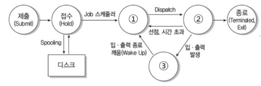
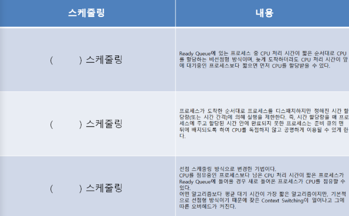

[[IPE-정보처리기사]](https://github.com/JaceKim-TheAL/D2501_Notes/tree/main/Q-Net/IPE)
---

# 필기요약 - 운영체제

- KeyWord : 스케줄링

---
### 스케줄링
`기출` 20년 1회 ♥️
- HRN 비선점형 스케줄링의 우선순위를 구하는 계산식을 쓰시오.

`정답` (대기 시간 + 서비스 시간)/서비스 시간
<br/>
<hr style="height: 2px; background-color: gray; border: none; width: 80%;">

### 운영체제
`기출` 20년 2회 
- 리눅스의 커널 위에서 동작하며, 자바와 코틀린으로 애플리케이션을 작성하는 운영체제로 휴대용 장치에 주로 사용되는 이 운영체제의 이름을 쓰시오.

`정답` Android
<br/>
<hr style="height: 2px; background-color: gray; border: none; width: 80%;">

### 유닉스 명령문
`기출` 20년 2회 ♥️
- 리눅스 또는 유닉스에서 'a txt'파일에 대해 다음 <처리 조건>과 같이 권한을 부여하고자 한다
- <처리 조건>을 준수하여 적합한 명령문을 작성하시오
```
<처리조건>
사용자에게 읽기, 쓰기, 실행 권한을 부여한다
그룹에게 읽기, 실행 권한을 부여한다
기타 사용자에게 실행 권한을 부여한다
한 줄로 작성하고, 8진법 숫자를 이용한 명령문을 이용한다
```

`정답` chmod 751 a.txt
<br/>
<hr style="height: 2px; background-color: gray; border: none; width: 80%;">

### 운영체제
`기출` 20년 4회 ♥️
- 다음 설명에 해당하는 운영체제(OS)를 쓰시오
```
1960년대 At& 벨 연구소가 MIT, General Electric 사와 함께 공동 개발한 운영체제
시분할 시스템을 위해 설계된 대화식 운영체제
대부분 C언어로 작성되어 있어 이식성이 높으며 장치, 프로세스 간의 호환성이높다
트리 구조의 파일 시스템을 갖는다
```

`정답` UNIX
<br/>
<hr style="height: 2px; background-color: gray; border: none; width: 80%;">


### 프로세스 
`기출` 20년 4회 ♥️
- 다음은 프로세스 상태 전이도이다. 괄호에 들어갈 알맞은 상태를 쓰시오.


`정답` 
① 준비
② 실행
③ 대기(보류)

<br/>
<hr style="height: 2px; background-color: gray; border: none; width: 80%;">


### CPU 스케줄링 알고리즘
`기출` 22년 3회 ♥️
-  다음은 스케줄링에 관한 내용이다. 괄호안에 알맞는 답을 작성하시오.


`정답` SJF, RR, SRT
<br/>

📊 CPU 스케줄링 알고리즘 비교 
| 항목 | SJF | RR  | SRT | 
| --- | --- | --- | --- | 
| 용어 | Shortest Job First | Round Robin | Shortest Remaining Time | 
| 스케줄링 방식 | 가장 짧은 작업 먼저 실행 | 순환 방식으로 일정 시간씩 실행 | 남은 시간이 가장 짧은 작업 우선 실행 | 
| 선점 여부 | ❌ 비선점형 | ✅ 선점형 | ✅ 선점형 | 
| 응답 시간 | 느림 | 빠름 | 빠름 | 
| 평균 대기 시간 | 낮음 | 중간 | 가장 낮음 (이론상) | 
| 공정성 | 낮음 (기아 현상 발생 가능) | 높음 | 낮음 (기아 현상 발생 가능) | 
| 작업 시간 필요 여부 | 필요 (미리 알아야 함) | 불필요 | 필요 (정확한 예측 어려움) | 
| 적합한 환경 | 배치 처리 시스템 | 사용자 인터페이스 중심 시스템 | 실시간 처리에 가까운 환경 | 
<br/>

💡 요약
- SJF: 효율적이지만 긴 작업은 계속 밀릴 수 있어요.
- RR: 공정하고 반응이 빠르지만 오버헤드가 생길 수 있어요.
- SRT: 가장 효율적이지만 예측이 어렵고 기아 현상 가능성이 있어요.
<br/>
<hr style="height: 2px; background-color: gray; border: none; width: 80%;">

### LRU와 LFU 알고리즘
`기출` 24년 1회 ♥️
- 다음은 운영체제 페이지 순서를 참고하여 할당된 프레임의 수가 3개일 때  LRU와 LFU 알고리즘의 페이지 부재 횟수를 작성하시오.

`정답` 
(1) 6
(2) 6
<br/>
<hr style="height: 2px; background-color: gray; border: none; width: 80%;">

### SRT 스케줄링
`기출` 24년 2회 ♥️
- 아래의 표를 확인하여 SRT 스케줄링의 평균 대기시간을 계산하여 작성하시오.
| 프로세스 |	도착시간	| 서비스 시간 |
|---|---|---| 
| A	| 0	| 8 | 
| B	| 1 |	4 |
| C	| 2 |	9 |
| D	| 3 |	5 |

`정답` 6.5
<br/>
<hr style="height: 2px; background-color: gray; border: none; width: 80%;">

### 
`기출` ♥️
- 

`정답` 
<br/>
<hr style="height: 2px; background-color: gray; border: none; width: 80%;">


---

<!--
### 
`기출` ♥️
- 

`정답` 
<br/>
<hr style="height: 2px; background-color: gray; border: none; width: 80%;">

---
-->
