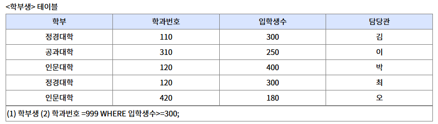
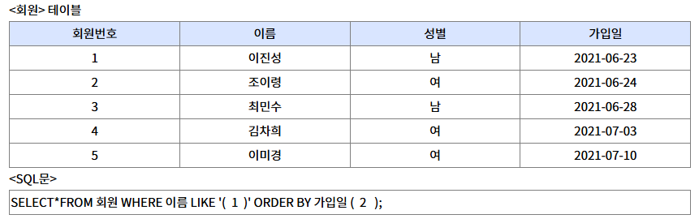
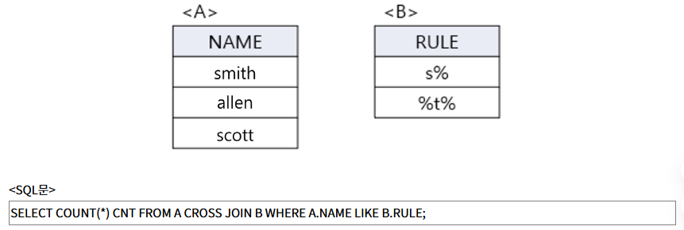
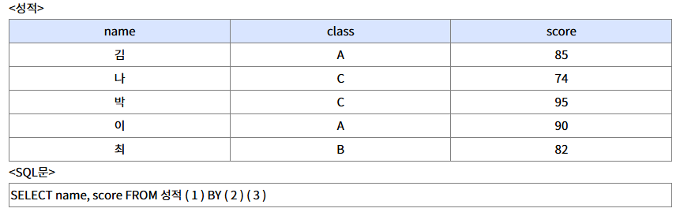
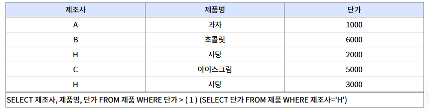
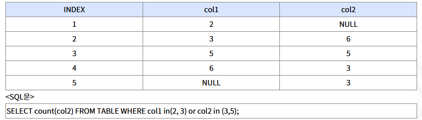
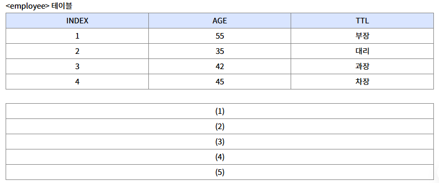

# 정보처리기사 실기 노트 정리

## 코드문제

### [정보처리기사 C언어, Java, Python, SQL 기출문제 모음](https://complainrevolutionist.tistory.com/38)

- [C](https://complainrevolutionist.tistory.com/category/C)
- [Java](https://complainrevolutionist.tistory.com/category/Java)
- [SQL](https://complainrevolutionist.tistory.com/category/%EC%98%A4%EB%9D%BC%ED%81%B4%20SQL)
  - [SQL 기출문제](#sql-기출문제)
  - [기타](#기타)

---
### SQL 기출문제
 

- `SQL문 작성` [20년 2회 - 6번]
  - 3, 4학년의 학번, 이름을 조회한다
  - IN 예약어를 사용해야 한다
  - 속성명 아래의 괄호는 속성의 자료형을 의미한다

`정답` 
SELECT 학번, 이름 FROM 학생
WHERE 학년 in (3, 4)
<br/>

- `SQL문 작성` ♥️♥️ 
  - <student> 테이블을 참고하여 'name' 속성으로 'idx_name'이라는 인덱스를 생성하는 SQL문을 작성

`정답`
CREATE INDEX idx_name ON student(name);
<br/>

- `SQL문 작성`
  -  <학생> 테이블에서 '이름'이 "민수"인 튜플을 삭제하고자 한다. 다음 <처리 조건>을 참고하여 SQL문을 작성하시오.

`정답`
DELETE FROM 학생 WHERE 이름='민수';
<br/>

- `SQL문 작성` ♥️ 
  - 다음 <성적> 테이블에서 과목별 점수의 평균이 90점 이상인 '과목이름', '최소점수', '최대점수'를 검색하고자 한다. <처리 조건>을 참고하여 적합한 SQL문을 작성하시오.
  - 처리조건: 
    - WHERE문을 사용하지않는다
    - GROUP BY와 HAVING을 이용한다
    - 집계함수를 사용하여 명령문을 구성한다
    - 최소점수, 최대점수는 별칭을 위한 A 문을 이용한다
    - 명령문 마지막의 세미콜론은 생략이  능하다
    - 인용 부호가 필요한 경우 작은 따옴표를 사용한다

`정답`
SELECT 과목이름, MIN(점수) as 최소점수, MAX(점수) as 최대점수
FROM 성적
GROUP BY 과목이름
HAVING AVG(점수) >= 90;  
<br/>

- `SQL문 작성` ♥️♥️
  - 다음  <속성 정의서>를 참고하여 <학생> 테이블에 대해 20자의 가변 길이를 가진 '주소' 속성을 추가하는 <SQL문>을 완성하시오.


`정답`
ALTER TABLE 학생 ADD 주소 VARCHAR(20);
<br/>
(1) ALTER   (2) ADD

- `SQL문 작성` 
  - 학생 테이블에서 학과별 튜플의 개수를 검색하시오
  

`정답`
SELECT 학과, COUNT(*) AS 학과별튜플수
FROM 학생
GROUP BY 학과

- `SQL문 결과` 
  - <EMP_TBL> 테이블을 참고하여 <SQL문>의 실행 결과


`정답`
1

- `SQL문 결과` 
  - 다음 테이블에서 카디널리티와 디그리를 구하시오.


`정답`
카디널리티: 5, 디그리 : 4 <br/>

1. 카디널리티 (Cardinality) : 관계형 데이터베이스에서 테이블에 있는 튜플(행)의 수를 의미
2. 디그리 (Degree) : 테이블의 속성(컬럼)의 수를 의미

- `SQL문 작성` 
  - <학부생>테이블에서 입학생수가 300이상인 튜플의 학과번호를 999로 갱신하는 SQL문이다 괄호(1, 2)에 알맞은 답을 쓰시오.


`정답` (1) UPDATE   (2) SET  <br/>
UPDATE 학부생 SET 학과번호 = 999 WHERE 입학생수 >= 300;

- `SQL문 작성` 
  - 다음 <사원> 테이블과 <동아리> 테이블을 조인한 <결과>를 확인하여 <SQL문>의 괄호(1, 2)에 들어갈 알맞은 답을 쓰시오. 


`정답` (1) ON   (2) 코드  <br/>
SELECT a.코드, 이름,동아리명 FROM 사원 a LEFT 동아리 b ON a.코드=b.코드 ;

- `SQL문 작성` 
  - <회원> 테이블에서 '이름'이 "이"로 시작하는 회원들을 가입일 순으로 내림차순 정렬하는 <SQL문>이다 괄호(1, 2)에 들어갈 알맞은 답을 쓰시오


`정답` (1) 이%   (2) DESC  <br/>
SELECT * FROM 회원 
WHERE 이름 LIKE '이%' 
ORDER BY 가입일 DESC;

- `SQL문 결과` ♥️
  -  <A> 테이블과 < B>테이블을 참고하여 <SQL문>의 실행결과를 쓰시오


`정답` 4


- `SQL문 작성` 
  -  <성적> 테이블에서 이름(name)과 점수(score)를 조회하되, 점수를 기준으로 내림차순 정렬하여 조회하는 <SQL문>이다. 괄호(1~3)에 알맞은 답을 적어 <SQL문>을 완성하시오.


`정답` (1) ORDER   (2) score   (3) DESC  <br/>
SELECT name, score FROM 성적
ORDER BY score DESC;


- `SQL문 작성` ♥️ 
  -  상품 테이블에서 H제조사 전체 제품의 단가보다 더 큰 단가를 가진 제품을 모두 출력하는 SQL문을 완성하시오.


`정답` ALL <br/>
SELECT 제조사, 제품명, 단가 FROM 제품 
WHERE 단가 > ALL (SELECT 단가 FROM 제품 WHERE 제조사='H')

`Tip` SQL에서 ALL은 **하위 쿼리(Subquery)** 와 함께 사용되어 조건을 모든 결과 값에 대해 만족해야 한다는 의미를 나타내는 키워드

- `SQL문 결과` 
  -  다음 SQL 결과에 알맞는 답을 작성하시오.


`정답` 4 <br/>
NULL은 카운팅 되지 않는다.

- `SQL문 결과` 
  -  다음 테이블에서 𝝿 TTL(employee)에 대한 연산 결과 값을 작성하시오.


`정답` <br/>
(1) TTL <br/>
(2) 부장 <br/>
(3) 대리 <br/>
(4) 과장 <br/>
(5) 차장 <br/>

`TIP` TTL (Time To Live)의 의미 <br/>
TTL은 데이터가 얼마나 오래 살아남을 수 있는지를 정의하는 개념으로, SQL보다는 데이터베이스나 캐시 시스템에서 자주 사용된다.
- NoSQL DB (예: Redis, Cassandra): 특정 키나 레코드에 TTL을 설정하면, 일정 시간이 지나면 자동으로 삭제됩니다.
- SQL 기반 DB에서는 직접적인 TTL 기능은 없지만, 트리거나 스케줄러를 통해 유사한 동작을 구현할 수 있어요.
🧪 예시 (Redis에서 TTL 설정)
```bash
SET session:123 "active"
EXPIRE session:123 3600  -- 1시간 후 자동 삭제
```

- `SQL문 결과` 
  -  학생 테이블에 컴퓨터과 학생이 50명, 전기과 학생이 100명, 인터넷과 학생이 50명있다고 할 때, 다음 SQL문 1, 2, 3의 실행 결과로 표시되는 튜플의 수를 쓰시오. (단, DEPT 필드는 학과를 의미한다)
    - (1) SELECT DEPT FROM STUDENT;
    - (2) SELECT DISTINCT DEPT FROM STUDENT;
    - (3) SELECT COUNT(DISTINCT DEPT) FROM STUDENT WHERE DEPT ='인터넷과';

`정답` (1) 200   (2) 3   (3) 1


- `SQL문 작성` 
  -  <학생> 테이블에서 '이름'이 "민수"인 튜플을 삭제하고자 한다. 다음 <처리 조건>을 참고하여 SQL문을 작성하시오.(20년 3회차 기출과 동일)

`정답` DELETE FROM 학생 WHERE 이름='민수';


- `SQL문 작성` 
  -  다음 <성적> 테이블에서 과목별 점수의 평균이 90점 이상인 '과목이름', '최소점수', '최대점수'를 검색하고자 한다. <처리 조건>을 참고하여 적합한 SQL문을 작성하시오. (20년 3회차 기출과 동일)

`정답` 
SELECT 과목이름, MIN(점수) as 최소점수, MAX(점수) as 최대점수
FROM 성적
GROUP BY 과목이름
HAVING AVG(점수) >= 90;

- `SQL문 작성` 
  -  학생 테이블에 아래 데이터를 삽입하는 쿼리문을 작성하시오.

``` 
학번 : 9830287
이름 : 한국산
학년 : 3
과목명 : 경영학개론
전화번호 : 050-1234-1234
```

`정답` 
INSERT INTO 학생 (학번, 이름, 학년, 과목명, 전화번호)
VALUES(9830287, '한국산', 3, '경영학개론', '050-1234-1234');

- `SQL문 작성` ♥️
  -  뷰를 삭제할 때 참조된 뷰를 연쇄적으로 모두 삭제되도록 빈칸을 작성하시오.

```  
DROP VIEW 뷰이름 (가);
```

`정답` (가) cascade

- `SQL문 결과` ♥️
  - 다음 빈칸에 들어갈 UNION 연산에 대한 출력결과를 쓰시오


```sql
select A from t1
UNION
select A from t2
order by A desc;
```

`정답`
|　　A　　|
|:-------:|
|    4    |
|    3    |
|    2    |
|    1    |


- `SQL문 결과` ♥️
  - 아래 보기의 SQL 문장과 테이블을 참고하여 출력 값을 표로 작성하시오.
```sql
SELECT
    B
FROM
    R1
WHERE
    C IN (SELECT C FROM R2 WHERE D="K");
```

`정답`
|　　B　　|
|:-------:|
|    a    |
|    b    |


- `SQL문 작성` 
  -  빈칸에 들어갈 것을 쓰시오
``` sql
1) 신입 사원을 사원 테이블에 추가
INSERT INTO 사원 (사원번호, 이름, 주소, 부서)   [      가     ] (12345, '김길동', '서울', '영업');

2) 위에 추가한 신입사원을 부서 테이블에 추가
INSERT INTO 부서 (사원번호, 이름, 나이, 부서)
[    나    ] 사원번호, 이름, 나이, 23 FROM 사원 WHERE 이름 = '김길동';

3) 전체 사원 테이블 조회
SELECT  *   [    다   ]   사원;

4) 추가한 신입사원을 '퇴사'로 변경
UPDATE 사원   [      라    ]   부서  =  '퇴사'  WHERE 사원번호  = 12345;
```

`정답` (가) VALUES   (나) **SELECT**   (다) FROM    (라) SET
<br/>


[[TOP]](#코드문제)
---
### 기타

- `SQL문 작성` 
  - 

`정답`
<br/>

<br/>

[[TOP]](#코드문제)
---
