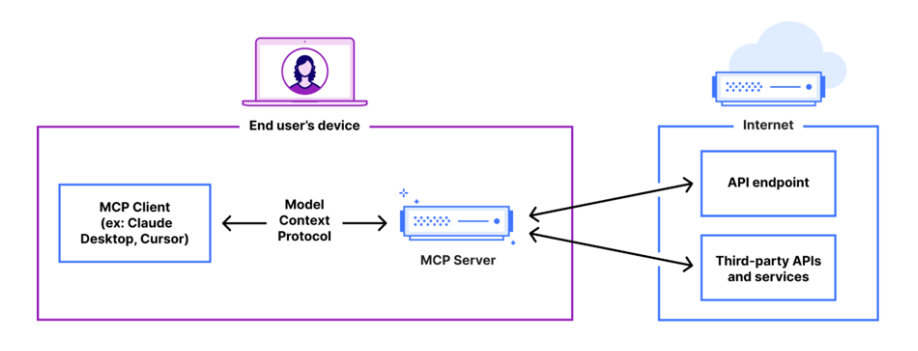

# MCP(Model Context Protocol)

|-------------:|
| [INDEX](./README.md) : |

- 개념
- 주요특징

---
- 개념 :
> - AI 모델과 외부 시스템(도구, 데이터 소스 등)을 연결하기 위한 개방형 표준입니다. 이 프로토콜은 AI 모델이 외부 데이터를 안전하고 효율적으로 활용할 수 있도록 설계되었습니다
> - AI 모델이 더 나은 맥락 지능(Contextual Intelligence)을 갖추도록 돕는 중요한 기술로, AI와 현실 세계의 도구 및 데이터를 연결하는 데 큰 역할을 합니다. 

> 

- 주요요특징
<ol>
    <li> 개방형 표준: MCP는 JSON-RPC 2.0 기반으로 설계되어, 다양한 환경에서 AI 모델과 외부 시스템 간의 양방향 통신을 지원합니다.
    <li> 통합 효율성: 기존의 개별 API 연결 방식 대신, MCP는 하나의 표준화된 규칙을 제공하여 개발자들이 더 쉽게 시스템을 통합할 수 있도록 돕습니다.
    <li> 보안 강화: 민감한 정보(API 키 등)를 직접 공유하지 않고도 안전한 연결을 제공합니다.
    <li> 다양한 응용 분야: 소프트웨어 개발, 기업 환경, 자연어 데이터 액세스 등 여러 분야에서 활용됩니다.
</ol>

