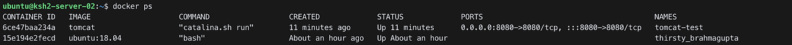

<p style="text-align: right"> 
    <a href="./README.md">[INDEX]</a>
</p>

# Docker 


## 1. Docker - 컨테이너 개념

### 도커(docker)의 정의
> 리눅스의 응용프로그램들을 소프트웨어 컨테이너(Container) 안에 배치시키는 일을 자동화하는 오픈소스 프로젝트

### 컨테이너(Container)


- 컨테이너라고 하면 가장 먼저 떠오르는 것은 바로 선박 컨테이너입니다. 동시에 '규격화', '운반의 용이성', '다양한 물건 탑재 가능' 등이 떠오릅니다.
- 아마 '컨테이너'라는 이름이 만들어진 것에는 실제 선박 컨테이너의 속성과 관련이 있을 것 같다는 생각이 듭니다!
<br/>
<br/>

### 소프트웨어 컨테이너(Software Container)


- 선박 컨테이너와 같이 소프트웨어 컨테이너도 다양한 프로그램, 실행 환경 등을 컨테이너로 추상화할 수 있을 뿐만 아니라 프로그램의 배포 및 관리를 단순하게 해주는 기능을 하고 있습니다. 
- 즉, '패키징'과 '운반'을 편리하게 해준다는 점이 바로 공통점입니다.
<br/>
<br/>

### 가상화(virtualization)와 리눅스(Linux) 컨테이너 


- 컨테이너를 이해하기 위해서는 일단 가상화라는 개념을 알고 있어야 합니다. 
> 가상화는 컴퓨터 리소스의 추상화를 일컫는 말입니다. 쉽게 말하자면, 애플리케이션, 서버, 저장장치 등 물리적으로 하나인 것을 복수의 것처럼 또는 반대로 복수의 것을 하나인 것처럼 만들어 주는 기술입니다.
- 가상화를 통해서 가상머신(VM)을 만들어 낼 수 있습니다.
> VM은 호스트 운영체제에서 구동되며 그 바탕이 되는 하드웨어에 가상으로 액세스하는 Guest 운영체제를 가지는 일종의 격리된 머신 입니다. <br/>
> 쉽게 생각하면 하나의 컴퓨터입니다. (물리적인 컴퓨터 자원을 가상화시켜 별도의 컴퓨터를 만든 뒤 거기에 필요한 운영체제를 올렸다고 생각합시다.)
- 컨테이너는 가상머신과 마찬가지로 애플리케이션을 관련 라이브러리 및 모든 종속항목과 패키지(그냥 APP에 필요한 모든 파일, 설치파일들, 필요한 모든 것들)로 묶어 소프트웨어 서비스 구동을 위한 격리환경을 마련해 주지만 큰 차이점이 있습니다.
> 바로 가상화 방식이 다르다는 점입니다. 기존의 VM을 생성하는 가상화 방식은 주로 OS를 가상화하였습니다. Host OS가 존재하고 그 위에 Guest OS 전체를 가상화하는 방식이었습니다. 그러므로 OS가 가상머신 이미지에 포함되어야만 하고 이는 용량이 매우 클 수밖에 없는 구조입니다. <br/>
> 가상화 기술의 발전으로 성능이 좋아졌다고는 하지만, 전가상화와 반가상화 등 Guest OS를 포함하여 운영하는 방식은 여전히 하드웨어 성능을 100% 뽑아낼 수 없습니다.
아래 첨부한 그림의 왼편을 보시면, 기존 가상화 방식의 구조를 파악할 수 있습니다.


> 하지만 컨테이너 기술은 다릅니다. 컨테이너는 별도의 하드웨어 에뮬레이션 없이 리눅스 커널을 공유하여 컨테이너를 실행하며 Guest OS가 존재하지 않습니다. <br/>
> 이런 가상화를 '운영체제 수준의 가상화'라고 부릅니다. 이게 가능한 까닭은 바로 리눅스 컨테이너를 통해 '프로세스를 격리' 하는 것이 가능하기 때문입니다.
<br/>
<br/>

### 프로세스 격리
- 리눅스(Linux) 운영체제는 커널 공간과 사용자 공간이 존재합니다. 
> 이 중 사용자 공간을 여러 개로 나누어 프로세스에서 사용하는 리소스를 제한할 수 있습니다. 이것이 바로 컨테이너의 근간이 되는 기술입니다. <br/>
> 즉 각각의 프로세스가 독립된 공간에서 할당받은 자원을 이용하여 동작하도록 만들 수 있는 것입니다. 이게 가능한 이유는 다음과 같은 기술을 리눅스(Linux)에서 제공하기 때문입니다.

> - 리눅스 네임스페이스(namespace) 

> 리눅스 네임스페이스는 각 프로세스가 파일시스템, 네트워크, 유저, 호스트네임 등에 대해서 시스템이 독립뷰를 가질 수 있도록 만들어 줍니다.

> - 리눅스 컨트롤 그룹(cgroups)

> 리눅스 컨트롤 그룹은 프로세스가 소비할 수 있는 리소스(CPU, 메모리, I/O, 네트워크 대역)등을 제한할 수 있는 기능으로 각각의 프로세스에 리소스를 할당할 수 있습니다.
기존 가상화 기술에서는 VM이 실제 물리 하드웨어를 에뮬레이트 하므로, OS가 반드시 필요합니다. 하지만 리눅스 컨테이너(LXC)에서는 모든 프로세스가 호스트 OS에서 바로 시작합니다.  일반적인 프로세스와 다른 점은 그룹화를 통해 단절된 공간에서 동작한다는 것입니다. 리눅스 컨테이너 기술은 도커 컨테이너가 사용하는 기술의 근간이 되는 기술입니다. <br/>
> 즉, 컨테이너라는 것은 리눅스가 제공하는 기능을 이용하여 단절된 공간에서 할당받은 시스템 자원을 통해 독립적으로 가동되는 일종의 '프로세스' 입니다. <br/>
> 기회가 된다면, 다음 포스트에서는 리눅스 프로세스 격리기술에 대해서 자세히 다뤄보도록 하겠습니다.

### Wrap Up
- 컨테이너를 이해하는 가장 중요한 핵심은, '컨테이너는 리눅스 환경에서 돌아가는 일종의 프로세스이다.' 라는 말입니다. 
- 이 개념을 이해하고 적용해 본다면 컨테이너에 대한 이해가 훨씬 수월해질 것입니다.
<br/>
<br/>

---

## 2. Docker - 컨테이너 장점

### 빠른 속도와 효율성


> 하드웨어 에뮬레이션이 없으므로 컨테이너는 아주 빠른 속도로 실행됩니다. <br/>
> 기존의 VM과 비교하면 비교도 안 될 만큼 빠른 속도입니다. <br/>
> 컨테이너 생성이라는 것은 OS 입장에서 단순히 프로세스를 시작하는 것과 같습니다. <br/>
> 가상환경이 커널에서 공유되기 때문에 새로운 커널을 시작할 필요도, 하드웨어 초기화 등의 작업도 필요 없습니다. <br/>
> 물론 프로세스를 격리하는 오버헤드가 존재하지만, VM의 하드웨어 에뮬레이트와 비교하였을 때 오버헤드가 거의 존재하지 않는 것과 마찬가지입니다.

### 높은 집적도


> 컨테이너는 커널이 직접 프로세스를 조작하여 공간을 분리하기 때문에 OS는 하나만 존재합니다.  <br/>
> 그렇기에 여러 개의 컨테이너를 만들어 실행하여도 하나의 OS 위에서 돌아가기 때문에 VM에 비해 고밀도가 가능합니다. <br/>
> 즉, 하나의 머신에서 프로세스를 실행하듯 많이 실행하는 것이 가능하다는 의미입니다.

### 높은 이식성


> 모든 컨테이너는 호스트의 환경이 아닌 독자적인 실행환경을 가지고 있습니다. 이 환경은 파일들로 구성되며, 이미지 형식으로 공유될 수 있습니다. 리눅스 커널을 사용하고 같은 컨테이너 런타임을 사용할 경우 컨테이너 실행 환경을 쉽게 공유하고 재현할 수 있습니다. <br/>
> 물론, 컨테이너가 가진 이식성에도 한계가 존재합니다. 자세한 내용은 아래 링크를 통해 확인해 주시길 바랍니다.

### 애플리케이션 컨테이너 지원


> 컨테이너의 종류에는 크게 시스템 컨테이너(System Container)와 애플리케이션 컨테이너(Application Container)로 나뉩니다. <br/>
> 시스템 컨테이너는 컨테이너 기술들을 사용해 운영체제 위에 하드웨어 가상화 없이 운영체제를 실행합니다. 일반적인 리눅스(Linux)처럼 init 프로세스 등을 사용해 다수 프로세스가 같은 환경을 공유하는 것을 목표로 합니다. 시스템 컨테이너를 지향하는 런타임으로는 LXC와 LXD가 있습니다. <br/>
> 애플리케이션 컨테이너는 컨테이너 기술을 활용해 하나의 애플리케이션(프로세스)을 실행하는 것을 목표로 합니다. <br/>
> 독립적인 환경을 가진다는 점에서 시스템 컨테이너와 개념은 같습니다. <br/>
> 하지만 단 하나의 프로세스만 실행한다는 점에서 확장이 쉽고 관리가 용이합니다. <br/>
> 대표적인 애플리케이션 컨테이너 런타임으로는 바로 '도커(Docker)'가 있습니다. <br/>
> 헷갈리시나요? 쉽게 생각하면, 컨테이너의 목표가 OS냐 애플리케이션이냐 차이일 뿐입니다. 이 애플리케이션 컨테이너를 지원한다는 것은 엄청난 장점이 있습니다. 첫 번째로, 목적에 맞는 프로세스만 존재하는 환경을 간편하게 만들 수 있습니다. <br/>
> 웹 서버용 컨테이너라면 Apache Httpd 프로세스만 존재하는 컨테이너를 실행할 수 있는 것입니다. 두 번째로, 서버 운영 면에서의 장점을 가집니다. <br/>
> 애플리케이션 컨테이너는 서버 애플리케이션의 배포 단위를 새로 정의했고, 기존 IT 인프라는 물론 클라우드(Cloud)에도 큰 변화를 가져왔습니다. <br/>
> 기존 서버 운영 방식에서는 애플리케이션 실행을 위해 서버 컴퓨터의 상태를 지속해서 관리해야 했지만, 컨테이너 사용을 통해 애플리케이션별로 독립적인 환경을 구축하고 관리하는 것이 가능해졌기 때문에 서버 환경의 관리가 용이해 졌습니다.

### Wrap Up
컨테이너가 가진 장점
- 빠른 속도와 효율성
- 높은 집적도
- 낮은 오버헤드
- 높은 이식성
- 애플리케이션 컨테이너 지원

위의 장점들을 바탕으로 컨테이너는 대세(혹은 새로운 표준) 기술이 될 수 있었습니다.
<br/>
<br/>

---

## 3. Docker - 도커 이해하기

### 도커(Docker)의 정체


- 도커(Docker)는 무엇일까요? <br/>
> - 많은 사람들이 '도커 = 컨테이너(Container)' 라고 생각하지만 위에서 살펴보았듯이 컨테이너 기술은 도커가 탄생하기 한참 전부터 존재헀습니다. <br/>
> - 도커는 컨테이너 기술을 지원하는 다양한 프로젝트 중 하나일 뿐입니다. 그렇다면 도커만이 가지는 장점은 무엇이기에 이렇게 유명해 졌을까요? <br/>
> - 도커는 오버레이 네트워크(Overlay Network), 유니온 파일 시스템(Union File System)등 이미 존재하고 있는 기술들을 정교하게 잘 조합하여 사용자 입장에서 정말 사용하기 편리하게 만들어 놓았습니다. <br/>
> - 그리하여 도커는 컨테이너 기술 분야의 'De facto Standard'(사실상 업계 표준)이 될 수 있었습니다.

### 도커 이미지(Docker Image)


- 컨테이너라는 개념과 더불어 도커에서 가장 중요한 개념이 바로 '이미지(Image)' 입니다. <br/>
> - 이미지는 우리가 흔히 생각하는 사진이라고 생각하시면 안됩니다. 도커에서 이미지는 컨테이너 실행에 필요한 모든 파일과 설정 값 등을 포함한 것으로 상태값을 가지지 않고 변하지 않는 것입니다. <br/>
> - '상태값'이 이해가 가지 않으면 일단 넘어가시고 전체적인 느낌을 봐주시면 됩니다. <br/>
> - 이미지는 특정 프로세스(프로그램)을 실행하기 위한 모든, 정말 모든 파일과 설정값 등을 지닌 것으로 더 이상의 의존성(dependent) 파일을 컴파일 하거나 설치할 필요가 없습니다. <br/>
> - redis 이미지는 redis 실행에 필요한 모든 파일을 가지고 있고, Gitlab 이미지는 centos를 기반으로 DB, Ruby, 포트정보등 필요한 모든 정보를 가지고 있습니다.<br/>
> - 정말 이미지를 다운로드 받고(pull) 실행(run)하는것 만으로 하나의 컨테이너를 실행할 수 있습니다. 즉, 컨테이너는 '이미지를 실행한 상태' 라고 봐도 무방합니다.
<br/>
<br/>

- 새로운 서버가 추가되면 이것저것 설치할 필요없이 미리 만들어진 이미지를 다운로드 받고 컨테이너만 생성하면 되므로 서버 증설이 매우 용이합니다. 이러한 장점은 클라우드 환경에서 더욱 빛을 발하겠죠? <br/>
> - 서버 사용량에 따라 클라우드 환경에서 on-demand로 서버를 증설하고 그 뒤 컨테이너를 띄우는 것만으로도 새로운 사용자를 받아들일 준비가 되는 것 입니다.
<br/>
<br/>

### 레이어(Layer) 저장방식
- 도커 이미지의 강력함을 조금이라도 느끼셨나요? 그런데 여기서 이런 의문이 생길 수도 있습니다. 실행에 관련 된 모든 파일을 포함하고 있다면 용량이 매우 클 것 같은데, 만약 기존 이미지에 파일하나 더 추가했다고 다시 그 큰 용량을 다운로드 받아야 하나? 그렇다면 굉장히 비효울적이지 않을까? 
- 맞습니다. 굉장히 비효율적입니다. 그래서 도커는 굉장히 영리한 저장방식을 사용합니다. 바로 'Layer 저장방식' 입니다. 레이어 저장 방식은 유니온 파일 시스템(Union File System)을 이용하여 여러개의 Layer를 하나의 파일시스템으로 만드는 방식을 의미합니다. 다음 그림을 보시면 직관적으로 이해하실 수 있을겁니다.


> - 그림에서 살펴볼 수 있듯이, 이미지 하나는 여러개의 immutable layer로 구성됩니다. immutable의 의미는 '불변' 이라는 의미입니다. 즉 읽기 전용이지 쓰기는 되지 않는다는 것입니다. 이 immutable 레이어들은 절대로 변하지 않습니다. <br/> 
> - 우분투(ubuntu)의 이미지가 A, B, C 레이어로 이뤄져 있고 이미 우분투 이미지를 저장해서 가지고 있다고 가정해 보겠습니다. 우분투 이미지가 이미 있는 상태에서 우분투 기반의 nginx 이미지를 도커허브(Docker Hub)에서 가져온다면(pull) 어떻게 될까요? A+B+C+nginx 레이어로 이루어진 이미지를 통째로 가져올까요? 아닙니다. (예시를 A, B, C 레이어로 든 것이지 실제 우분투와 nginx의 컨테이너 이미지 구조와 동일하지는 않습니다.) 이 경우에는, 이미 존재하는 A+B+C 레이어는 다운로드 받지않고 새로 필요한 nignx 레이어만 다운로드 받아 새로운 이미지를 구성합니다.<br/> 
> - 웹 앱을 nginx 위에 올린 컨테이너를 실행하다가, 웹 앱 소스를 수정하게 된다면 A+B+C+nginx 레이어를 제외하고 소스레이어만 다운받으면 되기에 효율적으로 이미지를 관리할 수 있습니다. 또한 이미지를 공유할 때도 바뀐 레이어만 공유할 수 있는 장점을 가집니다. 제가 nginx 이미지를 pull 받아 그 위에서 웹 앱 소스를 추가하여 새로운 이미지를 생성하여 도커허브에 공유했다고 생각해 봅시다. 누군가 제가 올린 이미지가 필요한 상태이고, 이미 nginx 이미지를 저장하고 있는 상황이라면 nginx 이미지는 다운로드 받지 않고 웹 앱 레이어만 다운로드 받으면 되는 것입니다.<br/> 
> - 또한 이미지를 기반으로 컨테이너를 생성하게 되면 자동으로 R/W레이어가 추가되어 생성됩니다. 이미지 레이어(Immutable)를 그대로 사용하면서, 컨테이너 실행 중 생성하는 파일이나 변경사항은 모두 R/W레이어에 기록 됩니다. 기존의 이미지 레이어는 절대로 변하거나 영향을 받지 않습니다. 그래서 'Immutable', '상태값을 가지지 않고 변하지 않음' 이라는 표현을 사용하는 것입니다.

### Wrap Up
- 도커 이미지는 컨테이너 실행에 필요한 모든 파일과 설정 값 등을 포함한 것으로 상태값을 가지지 않고 변하지 않는 것입니다. 
- 도커는 굉장히 영리한 저장방식을 사용합니다. 바로 'Layer 저장방식' 입니다. 이미지 하나는 여러개의 immutable layer로 구성됩니다.
<br/>
<br/>

---
## 4. Docker - 도커 이미지 이해하기

### 도커 이미지(Docker Image) 경로


> - 도커 이미지는 URL과 태그를 이용하여 관리 됩니다. <br/>
> - 아래 코드를 보시면, 이미지를 pull 받을 때는 'nginx:latest' 라는 이미지를 요청했습니다. 하지만 실제로 받아온 이미지의 이름은 docker.io/library/nginx:latest인 것을 확인할 수 있습니다. 둘은 사실 같은 의미를 가집니다.
> 
> <br/>
> - 도커의 이미지 이름은 문자열 입니다. 도커허브를 기준으로 도커 이미지의 이름은 <NAMESPACE>/<IMAGE_NAME>:<TAG> 형식입니다. nginx의 경우 library라는 도커 허브의 공식 이미지가 저장되어 있는 네임스페이스에서 nginx라는 이름을 가진 이미지의 latest 버전을 가져온 것입니다. <br/>
> - Dokcer.io는 이미지 저장소의 실제 주소를 가리킵니다. 그 말은 다른 도커 이미지 저장소(Registry)의 주소가 올 수도 있다는 이야기 입니다. 여기서 nginx:latest 라는 간략한 문자열로 이미지를 pull 받는 것이 가능한 이유는, 도커 클라이언트의 기본 저장소(Registry)가  docker.io(도커 허브)이기 때문입니다.<br/>
> - docker.io 이외에도 개인별로, 기관 혹은 조직 별로 저장소를 구축해 사용하고 있습니다. Private Registry를 구축하여 사용하는 방법은 다음에 포스트 하겠습니다.
<br/>
<br/>

### 이미지 생성방식


> 그렇다면 이미지는 어떻게 만드는 것일까요? 
> - 사실 이 주제는 짧게 설명하기에는 힘든 주제라서 간략하게 설명하고 하나의 포스트로 새로 작성하도록 하겠습니다. <br/>

> 도커는 이미지를 만들기 위해서 Docker File 이라는 파일에 자체 DSL(Domain-Specific-Language)를 이용하여 이미지 생산 과정을 명시합니다.
> - 의존성 패키지를 설치하고 설정파일을 만들지 않고 Dockerfile을 통해 관리할 수 있습니다. 
> - 이 파일은 소스와 함께 버전이 관리되고 누구나 이미지 생산 과정을 볼 수 있어 수정 및 배포가 용이합니다.
<br/>
<br/>

### 이미지 저장소(Image Registry)


- 도커는 빌드한 이미지를 서버에 배포하기 위해서, 직접 파일을 복사하는 방법 대신 도커 레지스트리(Docker Registry)를 이용합니다.
- 도커 명령어를 이용하여, 이미지를 레지스트리에 push 하고 필요할 때는 레지스트리에서 pull하여 간편하게 사용 가능합니다.
<br/>
<br/>

### 도커 허브(Docker Hub)


- 도커 이미지의 용량은 앞서 언급 드린대로 수백mb 에서 수gb에 이릅니다. 
> 이렇게 큰 용량의 이미지를 서버에 저장하고 관리한다는 것은 쉬운 일이 아닙니다. 하지만 Docker는 도커 허브를 통해 공개 이미지를 무료로 관리해 주고 있습니다! 하루에도 엄청난 양의 이미지가 도커 허브에 저장되고, 또 사용되고 있습니다.
 
- 도커 허브를 통해 전 세계의 사람들과 이미지를 쉽게 공유할 수 있습니다. 
> 게다가 Ubuntu, centos 등의 기본 이미지와 java, python 등의 공식이미지가 저장되어 있습니다. 일반 사용자들이 만든 이미지도 이미 50만개가 넘게 저장되어 있습니다.
 
- 도커허브를 통해 우리는 'ubuntu:latest' 라는 간단한 이름을 명령어에 넣는 것 만으로도 최신버전의 ubuntu를 사용할 수 있는 것입니다.

<br/>
<br/>

---
## 5. 도커 설치 및 명령어 실습

### 도커(Docker) 설치
> 도커는 리눅스 컨테이너 기반의 기술입니다. 그러므로, 리눅스 OS가 아닌 맥이나 윈도우에 설치 시 가상머신에서 설치가 된다는 점을 생각하셔야 합니다.
<br/>

### `Linux`

- 리눅스에 도커를 설치하는 방법은 정말 간단합니다. 
> - 자동 설치 스크립트가 있기 때문입니다. <br/>
> - 아래의 명령어를 이용하여 간단하게 설치할 수 있습니다. <br/>
> - 아래 명령어를 입력하면, root 권한을 요구한 뒤(password 입력) 자동으로 설치가 완료 됩니다.<br/>
> (단 Linux는 ubuntu와 centos를 사용했습니다. 다른 Linux를 사용하시는 분은 https://docs.docker.com/engine/install/  를 참조해 주시면 감사하겠습니다.)

```
$curl -fsSL https://get.docker.com/ | sudo sh
```


### `Mac and Window`
- 맥이나 윈도우에 도커를 설치하려면, Docker for Mac 이나 Docker for WIndow를 설치해야 합니다. 
> 파일을 다운로드 받고 설치한 뒤 재부팅하면 대부분 문제없이 설치가 완료 됩니다. 다음 사진은 mac에 도커 데스크탑을 설치한 화면입니다. <br/><br/>

<br/>

> - 위에서 언급했듯이, 리눅스가 아닌 윈도우나 맥에 Docker for mac 이나 Docker for Window를 이용하여 도커를 설치할 경우 네이티브가 아닌 가상머신 위에서 동작하게 됩니다. 하지만 사용할때는 마치 네이티브에서 동작하는 것과 동일하다는 착각이 들만큼 차이가 거의 느껴지지 않습니다. <br/>
> - VM위에서 도커를 실행하면 무슨 장점이 있나 싶겠지만, 그래도 도커의 독립적인 실행환경을 사용할 수 있다는데 의의가 있습니다. <br/>
> - 개인적으로는 VMware나 Virtual Box를 이용하여 리눅스 가상머신을 만든 뒤에 도커를 설치하여 실습을 하기를 권장합니다. 물론 Docker for OS를 통해 따라하셔도 문제없습니다. 저는 KT cloud를 이용하여 리눅스 서버를 하나 생성한 뒤, 실습을 진행하였습니다.
<br/>
<br/>

### 설치 확인
- 설치가 완료되었다면, 다음 명령어를 통해 설치가 정상적으로 되었는지 확인해 보겠습니다.
```
$docker version
```

<br/>

> 정상적으로 설치 되었다면, 위와 같은 화면을 볼 수 있습니다. client와 server 정보가 출력 되었다면 완료입니다.
<br/>
<br/>

### 설치에러
1. permission denied 에러가 뜰 경우에는 sudo docker version 으로 실행해 보시길 바랍니다. <br/>
2. Cannot connect to the Docker daemon at unix://var/run/docker.sock 에러가 뜰 경우에는 다음 조치사항을 따라해 보시길 바랍니다.

```
> sudo systemctl unmask docker.service
> sudo systemctl unmask docker.socket
> sudo systemctl start docker.service
> sudo docker version
```
<br/>
<br/>

### Docker Client and Host

<br/>

> 설치가 완료된 후 , docker version을 통해 확인하면 client와 server 영역이 있는 것을 확인할 수 있습니다. <br/>
> 그건 Docker가 위와 같은 구조를 가지고 있기 때문입니다. <br/> 
> docker client에서 command를 입력하면(예를들어, docker run) 도커 client가 명령을 docker host로 전송하고 결과를 받아 터미널 창에서 보여주게 됩니다. <br/>
 
#### Docker Client
- Command를 입력하면 docker client에서 명령어를 Host로 전송하여 daemon에서 처리하게 됩니다. 클라이언트는 둘 이상의 데몬과는 통신 할 수 없습니다.
 
#### Docker Daemon
- API 요청을 수신하고, 이미지 ,컨테이너, 네트워크와 같은 Docker Object를 관리하는 역할을 수행합니다. 데몬은 Docker 서비스를 관리하기 위해 다른 데몬과 통신 할 수도 있습니다.
- 어려운 내용은 일단은 지나쳐도 좋습니다. 중요한 점은 도커는 서버와 클라이언트의 역할을 각각 수행할 수 있고, 클라이언트가 서버로 명령을 보내 처리 결과를 출력해 주는 방식을 가진다는 것입니다.

<br/>
<br/>

### 컨테이너 실행하기 
```
$docker run [OPTIONS] [IMAGE:TAG]
```

- 도커를 이용하여 컨테이너를 실행시키는 방법은 다음과 같습니다. 
> run 명령어를 통해 Image를 컨테이너로 실행시키게 됩니다. <br/>
> 이 때, run시킨 이미지가 로컬 registry에 없을 경우, 자동으로 docker hub를 통해 image를 pull 받아 온 뒤 실행시킵니다.
- 아래는 컨테이너 실행 시, 자주 쓰이는 옵션을 모아놓았습니다. 
> 아래 옵션들만 잘 기억해 놓으시면 컨테이너를 실행시키는 것에 크게 문제가 없을것입니다.

<table style="border-collapse: collapse; width: 100%;" border="1" data-ke-align="alignLeft" data-ke-style="style12">
    <tbody>
        <tr>
            <td style="width: 20%;"><b>옵션</b></td>
            <td style="width: 80%;">&nbsp;</td>
        </tr>
        <tr>
            <td><b>-d</b></td>
            <td>detached mode로 백그라운드 모드를 의미합니다.</td>
        </tr>
        <tr>
            <td><b>-p</b></td>
            <td>Host와 컨테이너의 포트포워딩 옵션입니다.</td>
        </tr>
        <tr>
            <td><b>-v</b></td>
            <td>Host와 컨테이너의 디렉토리를 연결해 볼륨을 만드는 옵션입니다.</td>
        </tr>
        <tr>
            <td><b>-e</b></td>
            <td>컨테이너 내 환경변수를 설정할 때 사용합니다.</td>
        </tr>
        <tr>
            <td><b>-name</b></td>
            <td>컨테이너의 이름을 설정합니다.</td>
        </tr>
        <tr>
            <td><b>-rm</b></td>
            <td>프로세스가 종료되면 자동으로 컨테이너를 제거하는 옵션입니다.</td>
        </tr>
        <tr>
            <td><b>-it</b></td>
            <td>-i 옵션과 -t 옵션을 함께 사용한 것으로, 직접 컨테이너에 접속해 터미널 입력을 위한 옵션입니다.</td>
        </tr>
        <tr>
            <td><b>-link</b></td>
            <td>컨테이너를 연결해 주는 옵션입니다.</td>
        </tr>
    </tbody>
</table>
<br/>
<br/>

### 컨테이너로 우분투(Ubuntu) 실행하기
- 백문이 불여일타라는 말이 있듯이, 실전으로 들어가서 컨테이너를 사용해 보겠습니다.
> docker run 명령어를 이용해서 ubuntu를 실행시켜 보겠습니다. <br/>
> 
<br/>

> docker run ubuntu:18.04 명령어를 통해 우분투를 실행시켜 보았습니다. <br/>
> 사진을 통해 일련의 과정을 확인하실 수 있습니다. <br/>
> 1. 처음에는 local에서 ubuntu:18.04의 이미지가 있는지 확인 합니다.
> 2. 이미지가 없는것을 확인 후, library/ubuntu 즉, 도커허브에서 이미지를 pull 받습니다.
> 3. 컨테이너를 실행합니다.
> <br/>

> 그렇다면, 컨테이너가 실행중이라는 것을 어떻게 알 수 있을까요? <br/>
> docker ps 명령어를 통해 가동중인 컨테이너의 리스트를 확인할 수 있습니다. <br/>
> (docker ps -a 옵션을 사용한다면 현재 중지되어있는 컨테이너까지 확인가능합니다.) <br/>
> 
<br/>

> 하지만, 아무리 찾아봐도 제가 실행시킨 ubuntu 컨테이너는 찾을 수 없습니다. 왜일까요? <br/>
> 일전에 설명드렸지만, 컨테이너는 프로세스이기 때문입니다. 실행중인 프로세스가 없다면 컨테이너는 종료됩니다. <br/>
> 컨테이너는 정상 실행되었지만, 실행중인 프로세스가 없어 종료된것입니다. <br/>
> 그래서 이번에는 위에서 배운 다른 옵션을 한 번 사용해 보겠습니다. <br/>
> ubuntu 컨테이너를 실행시킨 뒤, bash 명령어를 실행시켜 보겠습니다. -it 옵션을 통해서 쉘에 키보드 입력을 할 수 있도록 하겠습니다. 그리고 ls 명령어를 통해 ubuntu를 실행시켰음을 확인할 수 있습니다. <br/>
> 
<br/>

> 이번에는 다른 결과가 나왔습니다. <br/>
> 무척 신기하지 않나요? 명령어 한줄로 ubuntu를 실행할 수 있다니.. <br/>
> 이미지도 탑재(Pull 받아짐)되어 있는지 확인해 보겠습니다.<br/>
> 
<br/>

> 실제로도 ubuntu image가 Pull 되어있는 것을 확인할 수 있습니다.
> image list를 확인하는 명령어
```
docker images 
```
<br/>
<br/>

### 컨테이너로 톰캣(Tomcat) 실행하기
- 이번에는 Tomcat을 컨테이너로 실행해보겠습니다. 더 다양한 옵션을 사용하니, 잘 따라와 주세요.<br/>
> 
> tomcat 실행 <br/>
> <br/>
> 
> docker ps 톰캣 확인 <br/>
> <br/>

> 이제 좀 감이 잡히시나요? <br/>
> - 처음 docker run 명령어를 실행하자, local에서 이미지를 찾고, 이미지가 없으니 docker hub에서 이미지를 pull 받아 오는걸 볼 수 있으실 겁니다.<br/>
> - 그리고 그 다음에는 docker ps 명령어를 통해 tomcat 컨테이너가 실행되고 있음을 확인할 수 있습니다.
명령어를 하나씩 뜯어서 보겠습니다.
```
$docker run -d -p 8080:8080 --name tomcat-test tomcat
```
> -d 옵션은 컨테이너를 백그라운드에서 돌리고 컨테이너 ID를 출력하는 옵션입니다. -detach로 표현하기도 합니다. 터미널 종료와 상관없이 컨테이너를 실행시키기 위함입니다. <br/>
> - -p 옵션은 host와 컨테이너의 port를 연결해주는 옵션입니다. host의 8080 포트와 container의 8080 포트를 연결합니다. <br/>
> - --name은 컨테이너의 이름을 정해주는 옵션입니다. 여기서는 tomcat-test로 컨테이너 이름을 정했습니다. <br/>
> - 그리고 마지막으로 tomcat image로 컨테이너를 실행시켰습니다. 이때 tag를 따로 붙이지 않는다면, default 값으로 :latest 태그가 붙으며 최신버전의 이미지를 pull 해서 가져오게 됩니다. <br/>
> - 그러면 실행 결과를 한 번 확인해 보겠습니다.

> 
> tomcat 실행화면 <br/>
> <br/>
> 사실 위와 같은 화면이 떠야 정상이지만, 아마 404 Error 페이지를 보고 계실 확률이 높습니다 ㅠㅠ <br/>
> tomcat 컨테이너 내부에서 몇 가지 수정을 해야만 정상적인 화면을 출력할 수 있습니다. <br/>
> 그리고 그럴 때 사용 가능한 명령어가 바로 docker exec 명령어 입니다. exec 명령어를 통해 외부에서 컨테이너 안으로 명령을 실행할 수 있습니다. <br/>
> <br/>
> 
> tomcat 수정 <br/>
> <br/>
> - docker exec 명령어에 익숙한 -it 옵션을 사용했습니다. 그리고 tomcat-test 제가 정한 컨테이너 이름이죠? <br/>
> 들어가서 위와 같은 명령어를 통해 약간의 수정을 가했습니다. mv 명령어는 move라는 의미를 가진 명령입니다.<br/>
> 저두 한참을 헤메다 구글링을 통해 이유를 찾았습니다. <br/>
> 커뮤니티의 요청에 따라 wepapp 폴더의 내용이 webapp.dist폴더로 옮겨갔다고 합니다. 그래서 wepapp 폴더가 비워져 있었고, 브라우저에 보여줄(응답해줄) 파일이 존재하지 않은 이유로 404 error가 났던것입니다! <br/>
> - 위와 같이 조치를 취해주면, 정상적으로 컨테이너가 동작함을 확인할 수 있습니다. <br/>
> 현재 저는 kt cloud를 이용하여, 클라우드 서버위에서 실습을 진행하고 있어 공인 ip를 통해 외부에서 접근하여 확인했습니다. <br/>
> 여러분이 로컬에서 실습을 진행하고 있다면, 단순히 localhost:8080을 통해 위와 같은 결과를 확인할 수 있을 것입니다. <br/>
<br/>
<br/>

### 컨테이너 정지 및 삭제
- 마지막으로 컨테이너를 정지하고 삭제하는 방법을 학습해 보겠습니다. <br/>
> 컨테이너를 중지하고, 삭제하는건 매우 간단하고 직관적 입니다.

```
$docker stop [options] conainer
$docker rm [options] container
```

- 정지는 말그대로 stop, 삭제는 rm 입니다. 
> 중지를 위해서는 컨테이너의 id 또는 name을 입력하면 됩니다. <br/>
> 한 번 이전에 가동시켰던 컨테이너를 정지 후 삭제 해 보겠습니다. <br/>
> 일단 docker ps 명령어를 통해 tomcat container가 실행중임을 확인할 수 있습니다.<br/>
> 
> tomcat container 실행 확인 <br/>
> <br/>

> 그 이후에, docker stop 명령어를 통해 컨테이너를 정지시켜보았습니다. 이때 컨테이너 아이디를 전부 적을 필요는 없습니다. id가 식별될 정도로 앞의 4자리에서 5자리 정도를 적어주시면 됩니다.<br/>
> 
> docker stop <br/>
> <br/>
> 이제 docker ps -a 를 통해 정지되어 있는 tomcat cotainer를 확인할 수 있습니다. STATUS를 확인해보면 정지되어 있음이 확인됩니다.<br/>
>  
> docker stop 확인 <br/>
> <br/>
> 마지막으로 rm 명령어를 통해 삭제해 보겠습니다. <br/>
> 
> docker rm <br/>
> <br/>
> docker rm 명령어를 통해 삭제한 뒤, 다시 한 번 컨테이너 목록을 확인해 보니 정지되어 있던 컨테이너가 완전히 삭제되어 있음을 확인 할 수 있습니다. <br/>
> 이 때, 삭제명령어 뒤에는 컨테이너 name을 적었습니다.(container id or name)
<br/> 
<br/>


# Wrap Up
- 이번 포스트를 통해 docker의 강력함과 신기함을 느끼셨으면 좋겠습니다.
- 역시, 글로만 읽는것보다는 실습을 통해 배우는것이 훨씬 재밌고 이해도 빠른것 같습니다.


