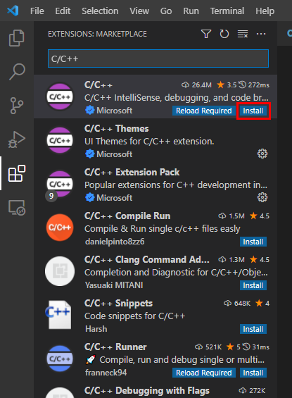
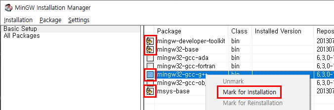
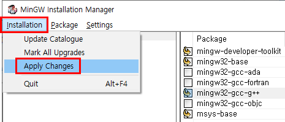
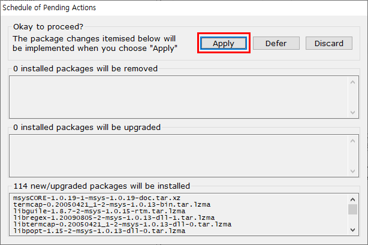
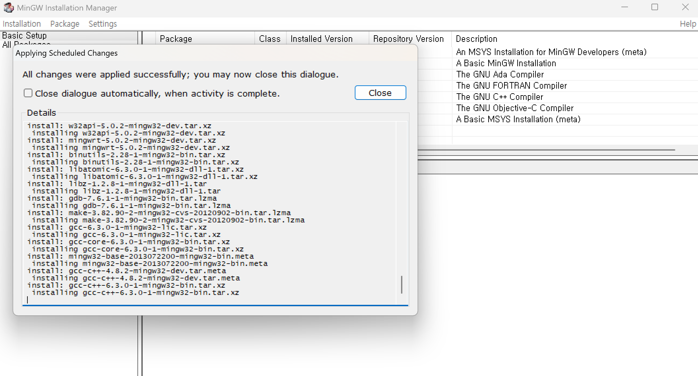
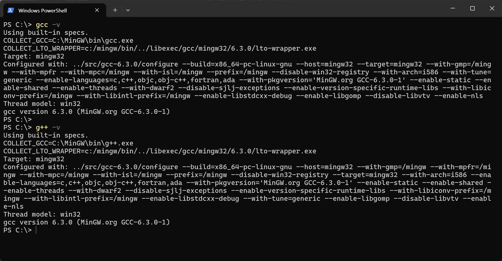

<p style="text-align: right"> 
    <a href="./README.md">[INDEX]</a>
</p>

# C++20 
> 2020년12월 공식적으로 발표 <br/>
> [CppReference.com](https://en.cppreference.com/w/cpp/20)
---

## 주요특징
### 1. 콘셉트(Concepts)
- 템플릿을 더 명확하게 정의할 수 있도록 도입된 기능으로, 타입 제약을 설정할 수 있습니다.
- 예: `template<typename T> requires Integral<T>`

### 2. 코루틴(Coroutines)
- 비동기 프로그래밍을 쉽게 구현할 수 있도록 지원하는 기능입니다.
- `co_await`, `co_yield`, `co_return` 키워드를 사용하여 비동기 작업을 처리할 수 있습니다.

### 3. 모듈(Modules)
- 기존의 `#include` 방식 대신 모듈을 사용하여 컴파일 속도를 개선하고 코드 재사용성을 높일 수 있습니다.
- 예: `export module my_module;`

### 4. 범위(Ranges) 라이브러리
- 기존의 STL 알고리즘을 더 직관적으로 사용할 수 있도록 개선되었습니다.
- 예: `std::ranges::sort(v);`

### 5. 우주선 연산자(Three-way comparison operator, `<=>`)
- 객체 간 비교를 간소화하는 연산자로, 자동으로 `==`, `<`, `>` 등의 비교 연산을 생성할 수 있습니다.

### 6. 새로운 표준 라이브러리 기능
- `std::span` : 배열을 더 안전하게 다룰 수 있도록 지원
- `std::format` : 문자열 포맷팅을 위한 새로운 기능
- `std::chrono` 개선 : 시간 및 날짜 관련 기능 확장

### C17 vs C20
<table>
  <tr>
    <td>버전</td>
    <td>주요 변경 사항</td>
    <td>개선된 점</td>
  </tr>
  <tr>
    <td>C17</td>
    <td>
      - 기존 C11 표준의 버그 수정 및 안정화<br/>
      - 새로운 기능 추가 없음
    </td>
    <td>
      - 기존 기능을 안정적으로 유지<br/>
      - 컴파일러 최적화 및 호환성 개선
    </td>
  </tr>
  <tr>
    <td>C20</td>
    <td>
      - typeof 키워드 추가<br/>
      - constexpr 개선<br/>
      - std::bit_cast 도입<br/>
      - std::span 추가
    </td>
    <td>
      - 코드 가독성 향상<br/>
      - 성능 최적화<br/>
      - 메모리 관리 개선
    </td>
  </tr>
</table>

✳︎ C20에서는 `코드 가독성` 및 `성능 최적화`에 초점을 맞추어 여러 기능이 추가
<br/>
<br/>

---
## 개발환경 셋팅

### 1. VS Code 설치
- [공식 웹사이트](https://code.visualstudio.com/) 에서 다운로드 후 설치
<br/>

### 2. C/C++ 확장 프로그램 설치
- VS Code에서 `Ctrl + Shift + X`를 눌러 Extensions 창을 엽니다.
- `C/C++`을 검색하여 Microsoft에서 제공하는 **확장 프로그램을 설치**합니다.

<br/>

### 3. 컴파일러 설치
> C20을 지원하는 컴파일러를 설치 <br/>
> 대표적인 컴파일러 : <br/>
> ▶ GCC (MinGW-w64): Windows에서 C/C++을 컴파일할 수 있도록 지원 <br/>
> ▸ [MinGW-w64 다운로드](https://sourceforge.net/projects/mingw/) <br/>
> ▸ 설치 후 `C:\MinGW\bin`을 **환경 변수(PATH)** 에 추가 <br/>
> ▶ Clang: 최신 C 표준을 지원하는 컴파일러 <br/>
> ▶ MSVC (Microsoft Visual C++): Visual Studio에서 제공하는 컴파일러로, VS Code에서도 사용 가능 

- **MinGW** 설치


> - 윈도우 API를 구현할 수 있는 헤더 파일을 이용해 GCC(GNU Compiler Collection)
> 즉, GNU 프로젝트의 일환으로 개발되어 널리 쓰이고 있는 컴파일러를 사용할 수 있게 하는 소프트웨어 도구 모음 
> - 쉽게 말해 Windows에서도 gcc를 사용할 수 있게 해주는 도구구



> - 설치 매니저에서, 빨간색으로 표시된 네 가지 패키지를 설치해주면 된다. 
> - 가장 마지막에 있는 `msys-base`는 맨 위의 `mingw-developer-toolkit`을 설치하면 자동으로 설치가 된다. 
> - 체크박스를 클릭하거나 마우스 우클릭 후 `Mark for Installation` 버튼을 클릭해 패키지를 설치할 수 있다.



> - 이후 상단 탭의 `Installation` - `Apply Changes`를 클릭 후 출력되는 창의 `Apply` 버튼을 클릭해주자.



> - 설치가 완료가 되었다면 `환경 변수`를 설정하자


<br/>

### 4. 환경 변수 설정
- `Win + R` → `sysdm.cpl` 입력 → 고급 탭 → 환경 변수 클릭
- `PATH`에 `C:\MinGW\bin` 또는 설치한 컴파일러의 경로를 추가
- 커맨드창에서 `gcc -v`, `g++ -v` 를 입력하여 MinGW 설치가 올바르게 되었는지 체크


<br/>

### 5. VS Code에서 빌드 및 실행 설정
- `Ctrl + Shift + P`를 눌러 명령 팔레트 오픈
- `Tasks: Configure Task`를 선택하여 `tasks.json` 파일을 생성
- tasks.json 파일에 다음과 같은 설정을 추가:
```json
[tasks.json]

{
  "version": "2.0.0",
  "tasks": [
    {
      "label": "C20 Build",
      "command": "gcc",
      "args": ["${file}", "-o", "${fileDirname}/${fileBasenameNoExtension}"],
      "group": "build"
    }
  ]
}
```
- `Ctrl + Shift + B`를 눌러 빌드 작업을 실행할 수 있다.
<br/>

### 6. 디버깅 설정
- `launch.json` 파일을 생성하여 디버깅 환경을 설정
- `Ctrl + Shift + P` → `Debug: Open launch.json`을 선택하여 설정을 추가
<br/>

### 7. 테스트 코드 작성 및 실행
- `main.c` 또는 `main.cpp` 파일을 생성하고 간단한 C20 코드를 작성
```c++
[main.cpp]

#include <iostream>
int main() {
    std::cout << "Hello, C20!" << std::endl;
    return 0;
}
```
- `Ctrl + Shift + B`를 눌러 빌드 후 실행
- 이제 Windows에서 VS Code를 활용하여 C20 개발을 시작!!!

---
cf. 참조링크 <br/>
- [mincoding](https://m.blog.naver.com/mincoding/221730943399)
- [velog.io ](https://velog.io/@cedongne/VSCode-Visual-Studio-Code%EC%97%90%EC%84%9C-CC-%EA%B0%9C%EB%B0%9C-%ED%99%98%EA%B2%BD-%EA%B5%AC%EC%B6%95%ED%95%98%EA%B8%B0)
